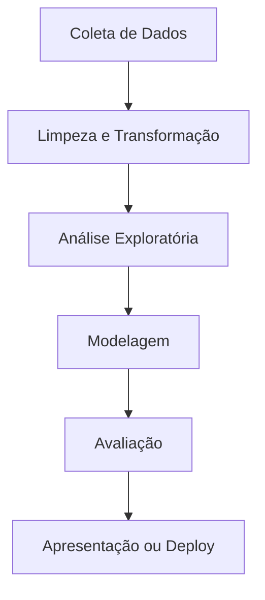

# 📘 Introdução Completa ao Python para Análise de Dados

Este repositório contém um módulo introdutório em Python voltado para **ciência e análise de dados**. Nele, abordamos desde os **conceitos básicos da linguagem** até aplicações práticas com **extração e manipulação de dados**, utilizando bibliotecas relevantes como `PyPDF2`, `SpeechRecognition` e sugestões de outras como `pandas`, `matplotlib` e `scikit-learn`.

---

## 📂 Estrutura

- `modulo_0_introducao_ao_python.ipynb`: Notebook introdutório com fundamentos e primeiras aplicações.
- Diretórios sugeridos:
  - `/datasets`: arquivos de dados (CSV, XLSX, etc.)
  - `/scripts`: scripts auxiliares em Python
  - `/notebooks`: outros notebooks (EDA, visualização, modelagem)
  - `/docs`: materiais explicativos, PDFs, artigos

---

## 🔰 Parte 1 – Fundamentos do Python

### 🧠 Conceitos Essenciais
| Conceito             | Exemplo                                                  |
|----------------------|----------------------------------------------------------|
| Variáveis            | `nome = "João"`                                          |
| Tipos de dados       | `int`, `float`, `str`, `bool`, `list`, `dict`, `set`    |
| Condicionais         | `if`, `elif`, `else`                                     |
| Laços de repetição   | `for`, `while`                                           |
| Funções              | `def saudacao(nome): return f"Olá, {nome}!"`            |
| Listas               | `idades = [21, 35, 60]`                                   |
| Dicionários          | `aluno = {'nome': 'Ana', 'nota': 9.5}`                   |

---

## 📊 Parte 2 – Python para Análise de Dados

### 🧰 Bibliotecas Principais

| Biblioteca       | Uso Principal                                     |
|------------------|--------------------------------------------------|
| `numpy`          | Cálculo numérico e vetorizado                    |
| `pandas`         | Manipulação de dados tabulares (DataFrames)     |
| `matplotlib`     | Gráficos básicos                                 |
| `seaborn`        | Visualização estatística                         |
| `scikit-learn`   | Machine Learning (modelos, métricas, pipeline)   |
| `PyPDF2`         | Leitura de arquivos PDF                          |
| `SpeechRecognition` | Conversão de áudio para texto                |
| `BeautifulSoup`  | Web scraping                                     |

---

### 💡 Fluxo de Trabalho em Ciência de Dados



---

### 🛠️ Exemplos Práticos

#### 📄 Leitura de PDF com `PyPDF2`
```python
from PyPDF2 import PdfReader

with open("arquivo.pdf", "rb") as f:
    leitor = PdfReader(f)
    for pagina in leitor.pages:
        print(pagina.extract_text())
```

#### 🎤 Conversão de Áudio com `SpeechRecognition`
```python
import speech_recognition as sr

reconhecedor = sr.Recognizer()
with sr.AudioFile('audio.wav') as source:
    audio = reconhecedor.record(source)
    texto = reconhecedor.recognize_google(audio, language="pt-BR")
    print(texto)
```

#### 🌐 Web Scraping com `BeautifulSoup`
```python
import requests
from bs4 import BeautifulSoup

url = "https://example.com"
resposta = requests.get(url)
sopa = BeautifulSoup(resposta.text, 'html.parser')

titulos = sopa.find_all('h1')
for t in titulos:
    print(t.text)
```

---

## 📈 Mini Guia Pandas

```python
import pandas as pd

df = pd.read_csv("dados.csv")
df.head()
df.describe()
df[df['coluna'] > 10]
df.groupby('categoria').mean()
df['coluna'].hist()
```

---

## 🔬 Mini Guia de Visualização

```python
import matplotlib.pyplot as plt
import seaborn as sns

sns.set(style="darkgrid")
sns.histplot(df["idade"], bins=20, kde=True)
plt.title("Distribuição de Idade")
plt.show()
```

---

## 🧪 Machine Learning com Scikit-learn

```python
from sklearn.model_selection import train_test_split
from sklearn.ensemble import RandomForestClassifier
from sklearn.metrics import accuracy_score

X = df.drop("target", axis=1)
y = df["target"]

X_train, X_test, y_train, y_test = train_test_split(X, y, test_size=0.2)
modelo = RandomForestClassifier()
modelo.fit(X_train, y_train)

y_pred = modelo.predict(X_test)
print("Acurácia:", accuracy_score(y_test, y_pred))
```

---

## 🚀 Executando no Google Colab

Abra o notebook via:
```text
https://colab.research.google.com/github/seu_usuario/seu_repo/blob/main/modulo_0_introducao_ao_python.ipynb
```

Instale dependências:
```python
!pip install PyPDF2 speechrecognition beautifulsoup4 pandas matplotlib seaborn scikit-learn
```

---

## 📚 Referências

- [Documentação Oficial do Python](https://docs.python.org/pt-br/3/)
- [pandas Docs](https://pandas.pydata.org/docs/)
- [Python for Data Analysis – Wes McKinney](https://wesmckinney.com/book/)
- [Curso gratuito - Python para Data Science (Cognitivo.ai)](https://cognitivo.ai)

---

## 🧾 Licença

Este material é livre para uso educacional e não comercial.

---

## ✍️ Autor

Baseado no módulo original do repositório, expandido com conteúdo técnico por ChatGPT para fins didáticos e profissionais.
